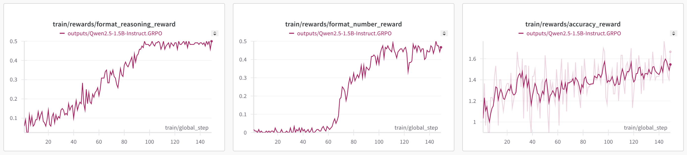
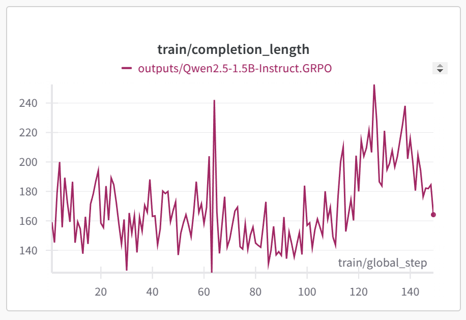
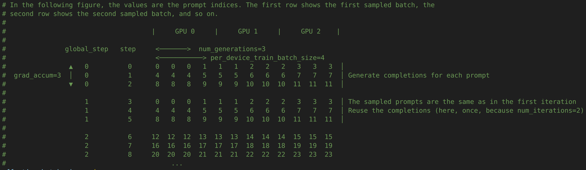

# gpu-rl : early experiments with training LLMs with RL

## Experiment 1 : GRPO on Qwen2.5-1.5B-Instruct with GSM8K dataset

The most classic experiment one can do to get its hands into the subject.
You can reproduce this experiment using only one A/H100 GPU by running `./train_one_gpu.sh`. 
Depending on the batch size, it should take a few hours.

These are the different rewards during training :

The total reward is the sum of these three rewards.
Accuracy reward goes from ≃1.1 to ≃1.5. Correct answer is 2, incorrect answer is 0, so accuracy actually goes from ≃55% to ≃75%.
For the two format rewards, it's either 0.5 or 0, so we see that the model learns to adapt almost perfectly the format of its response, after around 100 steps of RL.

*Note*: the accuracy reward, as its name suggests, tells if the model got the answer right. I quite changed its definition compared to what you can find in other scripts. For example, [here](https://gist.github.com/willccbb/4676755236bb08cab5f4e54a0475d6fb), the accuracy reward already assumes that the model correctly follows the output format requested. But this formulation make the accuracy reward and the reasoning format reward correlated. With this formulation, if the accuracy reward goes up, we don't know if it's because the model is actually better at GSM8K or is simply picking up the output format requested. That's why I changed it and choose to take the last int in the model's answer (just like [here](https://arxiv.org/abs/2402.10200)), hence independent of the formatting.

Here is the completion length through training :

    

## Visualizer of how prompts are organized into batches
One can easily be lost in the different parameters to the TRL trainer : `num_generations`, `per_device_train_batch_size`, `gradient_accumulation_steps`, `max_steps`, `num_iterations`...

I find this visualization, hidden in `trl/trainer/grpo_trainer.py`, very helpful :

    

- `num_generations` (or G in the paper) is <b>the number of samples/completions per prompt.</b> It is specific to GRPO, as the G differents completions of the same prompt form a "group" in <b>Group</b> Relative Policy Optimization.

- `per_device_train_batch_size` is <b>the number of trajectories each GPU will hold during the forward and backward pass.</b> This is sometimes called the micro batch size. After the forward+backward, the gradient is accumulated. Trajectory is prompt+completion. When short on memory, reducing the batch size is the first option to consider.

- `gradient_accumulation_steps` <b>controls the total batch size.</b> While `per_device_train_batch_size` specifies the batch size per forward+backward, we are often limited by GPU memory and want a bigger batch size that the one that can fit on our hardware. This is why we can do multiples passes and accumulate the gradients between those passes, and only at the end, after `gradient_accumulation_steps` passes, update the parameters. This is computationally equivalent to do one big pass with batch size `per_device_train_batch_size*gradient_accumulation_steps`, without using extra memory.

- `max_steps` <b>is the number of RL steps to execute.</b> One RL step is one update of the parameters (so, with batch size `per_device_train_batch_size*gradient_accumulation_steps`). In the little visualizer, RL step = "global step".

- `num_iterations` <b>allows reusing a trajectory multiple times</b>, by spending multiple RL steps on the same batch of trajectories. In the visualizer, `num_iterations=2`, meaning for example that `global_steps` `0` and `1` will share the same underlying data. Not going into too much detail here, but this is only possible with algorithms like TRPO,PPO,GRPO, because these algorithms prevent the updated policy to go too far from the current one. With these safeguards, it is possible to reuse multiple times the same data, which is very helpful from a data efficiency point of view because that means the algorithm can learn more from a trajectory before throwing it away. In this LLM+RL case, it's also a great speedup for RL training as collecting trajectories is very time consuming. This is not possible with other policy optimization algorithms like Vanilla Policy Gradient (VPG).

*<b>WARNING:</b>* if you've played with older version of TRL, like the one in [andyl98's PR](https://github.com/huggingface/trl/pull/2669), the behavior is different. The micro batch size was `per_device_train_batch_size*num_generations`, as opposed to simply `per_device_train_batch_size` in more recent versions of TRL. Hence, if you want to adapt your config from an old TRL version to a newer one, you should multiply you `per_device_train_batch_size` by `num_generations`.